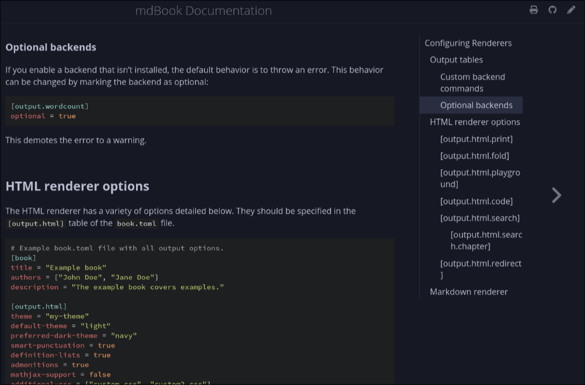

# mdbook-pagetoc

A mdbook plugin that provides a table of contents for each page. Uses css/js from [mdBook-pagetoc](https://github.com/JorelAli/mdBook-pagetoc).

## Show me



## Notes:

- Only supports the `html` renderer.

- On the first run of `mdbook build`, it creates two files `pagetoc.css` and `pagetoc.js`.

- You can customize any of them after the first run.

- [mdbook 0.5](https://github.com/rust-lang/mdBook/blob/master/CHANGELOG.md#mdbook-050) now ships with built-in support for showing the page
  table of contents in the sidebar, see [PR 2822](https://github.com/rust-lang/mdBook/pull/2822)

## Configuration:

- Add to `book.toml` config:

  ```toml
  [preprocessor.pagetoc]
  scroll_offset = 10  # pixels added to scroll position for active header detection (default: 10)

  [output.html]
  additional-css = ["theme/pagetoc.css"]
  additional-js  = ["theme/pagetoc.js"]
  ```

- The place marker `<div class="sidetoc"><nav class="pagetoc"></nav></div>` will be inserted inside the `<main>` tag. ie. This replaces

  ```hbs
  <main>
    {{{content}}}
  </main>
  ```

  with:

  ```hbs
  <main><div class="sidetoc"><nav class="pagetoc"></nav></div>
    {{{content}}}
  </main>
  ```

- If not customizing, you may want to add entries as appropriate to `.gitignore` to keep your repo clean:

  ```gitignore
  theme/pagetoc.css
  theme/pagetoc.js
  ```

- Customization: To autohide when only single header, add this snippet to `pagetoc.css`:

  ```css
  a[class^="pagetoc-H"]:only-child {
    display: none;
  }
  ```

- Customization: To hide a header from the table of content:
  ```md
  ## Hidden from TOC {.toc-ignore}
  ```

---

## Acknowledgments

- [mdBook-pagetoc](https://github.com/JorelAli/mdBook-pagetoc)

## Alternative

- [mdbook-theme](https://github.com/zjp-CN/mdbook-theme)
